# Introduction

IDC study states that 40% of Enteprises in year 2019 will be working to include AI/ML as a part of their transformative strategy. Today, AI/ML is beyond the hype cycle and there are usecases that are providing real business value. 

In this workshop, we will work on a healthcare insurance fraud identification usecase. We will apply machine learning to identify anomalous claims that require further investigation. The technique used in the workshop is broadly applicable to multiple problems fraud, abuse and waste.

## **Launch an Amazon SageMaker Jupyter Notebook**

### Prerequisites and assumptions
1. To run this Jupyter Notebook, you need an personal Laptop and an AWS account that provides access to AWS services.

### Steps
1. Sign In to the [AWS Console](https://aws.amazon.com/)
2. Click Services, search for **Amazon SageMaker** and Click **Amazon SageMaker** in the dropdown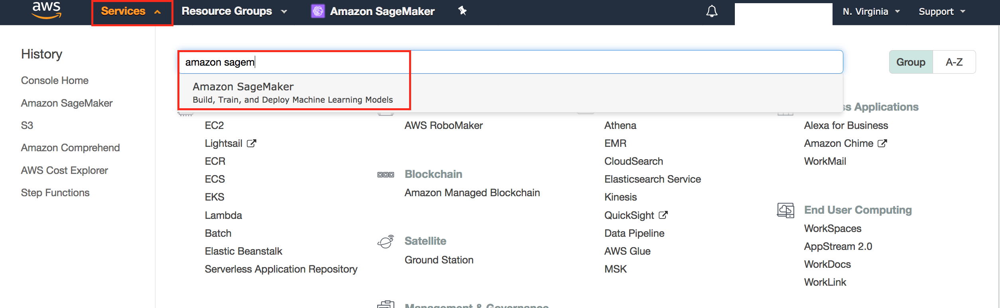
3. After you land on Amazon SageMaker console, click on **Notebook Instances**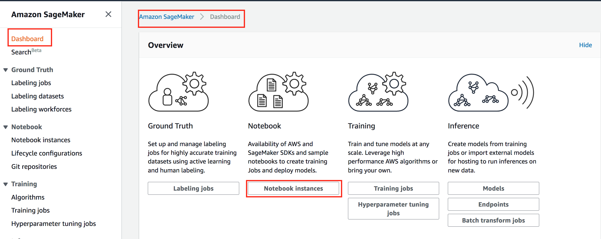
4. Click **Create Notebook**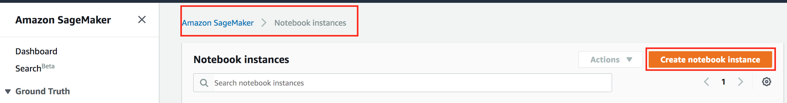
5. Give Notebook a name you can remember and fill out configuration details as suggested in the screenshots below.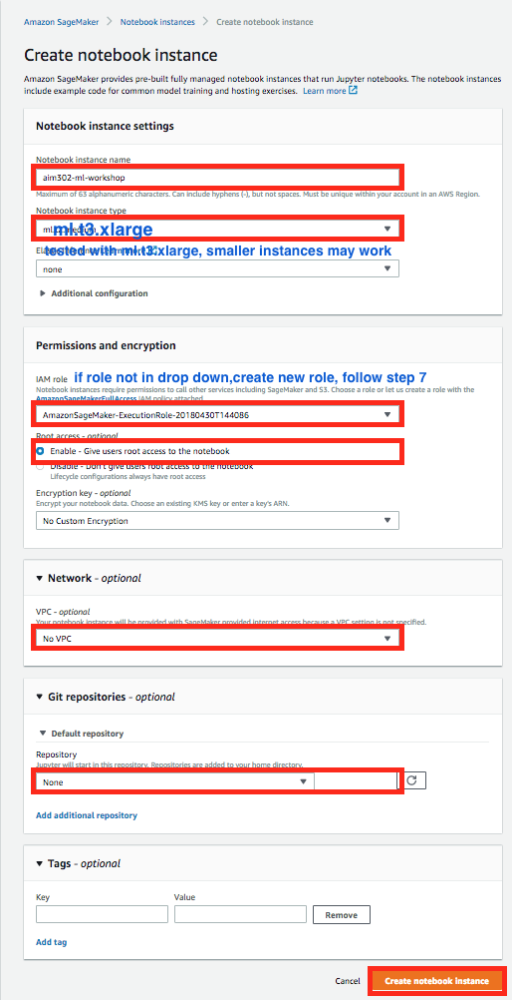
6. Select IAM Role if one already exists in the dropdown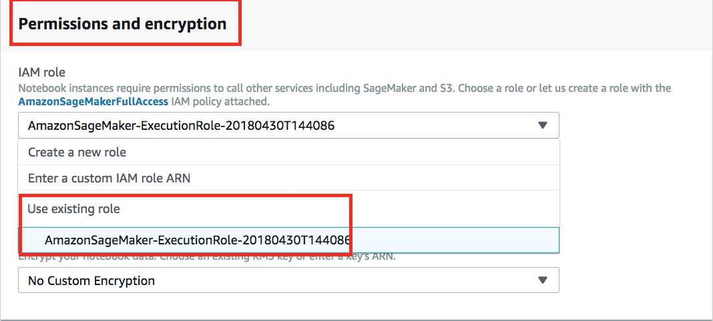
7. Create a new role if one doesn't exist. 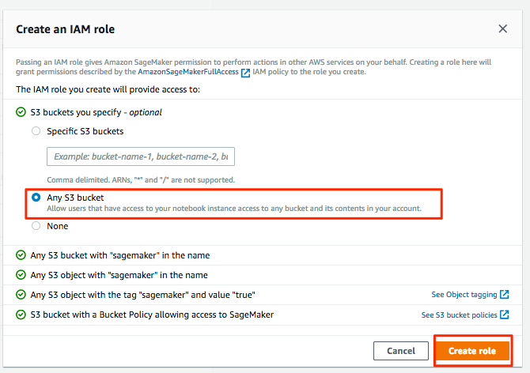
8. Provide  a path to clone public git repo that we will use today for our workshop to download data dictionary and Jupyter IPython Notebook 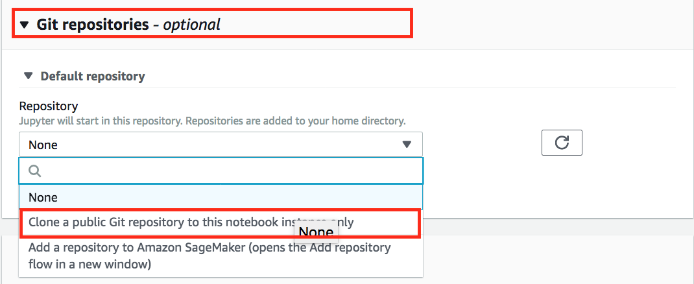 
9. Provide the path of [Git repo](https://github.com/aws-samples/amazon-sagemaker-healthcare-fraud-detection.git)
 
6. Click **Create Notebook Instance**
8. In the Amazon SageMaker Console-->Notebook Instances, wait for your notebook instance to start. Observe change from Pending to In Service status.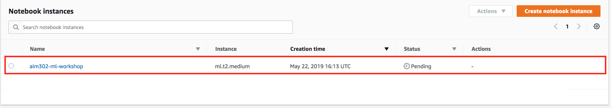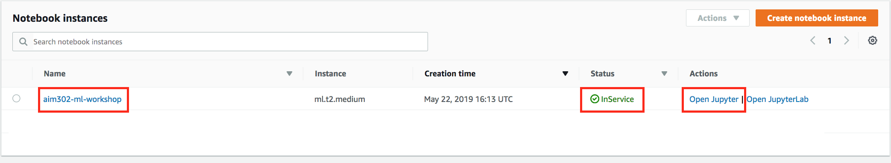
9. Remember the name of your notebook instance and Click **Open Jupyter** for your notebook.
10. Validate your data and notebook cloned from Git Repo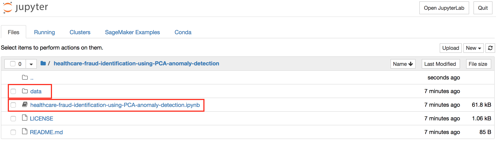

## **Finish your Lab in Jupyter Notebook**
1. Click on **healthcare-fraud-identification-using-PCA-anomaly-detection.ipynb** and start working. From here onwards all the instruction will be in the Jupyter Notebook. Come back after you have completed all the steps in the Jupyter Notebook and finish rest of the steps as suggested below.

## Finish
1. **Congratulations!** 
2. Please make sure to delete all resources as mentioned in the section below.

## Cleanup Resources
1. Go to Amazon SageMaker console to shutdown your Amazon SageMaker Jupyter Notebook Instance, select your instance from the list.Select **Stop** from the **Actions** drop down menu.
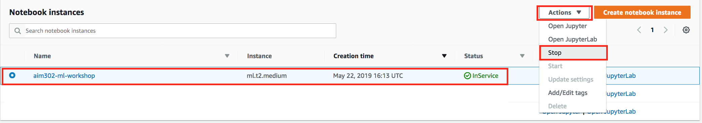
2. After your notebook instance is completely **Stopped**, select **Delete** fron the **Actions** drop down menu to **delete** your notebook instance.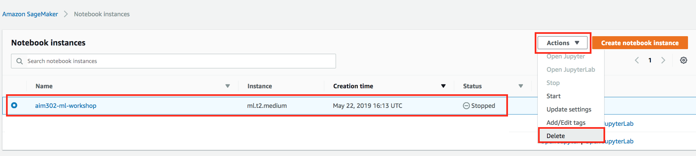
4. Navigate to Amazon S3 Console. 
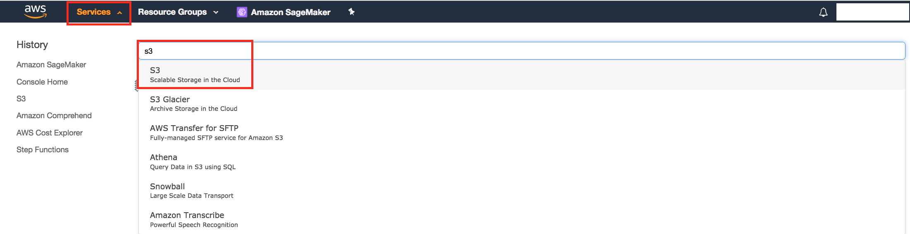
5. Find Amazon S3 bucket created for training and click to list objects in the bucket.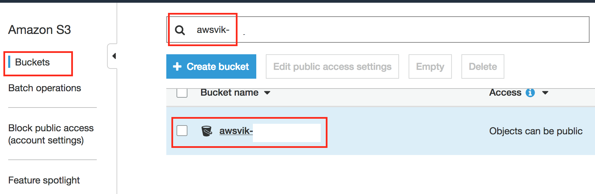
6. Navigate to the **model-tar.gz** and delete it by using **Actions** menu.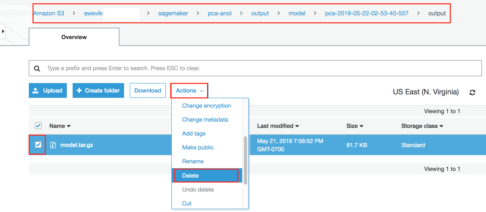 
6. Navigate to the training data file **healthcare_fraud_identification_feature_store** and delete it by using **Actions** menu.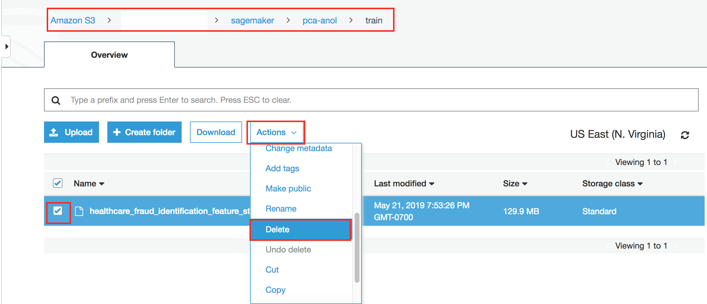
7. After all the objects are deleted in the bucket. Go ahead and delete the bucket using the Actions menu.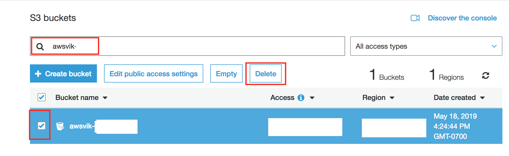

    

